# MSE544 Object Detection With YoloV5

Author: [Hang Hu](https://github.com/hanghu) & [Luna Huang](https://github.com/lunayuehuang), updated by Luna Huang and Yueyao Fan 2023 

This is a tutorial prepared for University of Washington MSE 544 class. In this tutorial, students will learn how to train and run YoloV5 on local machines; how to create GPU training clusters using Azure Machine Learning; how to depoly a project to Azure and running machine learning with Azure Machine Learning; and how to inference using trained model locally. 

In this tutorial, we would like to demonstrate how to build the work flow to adopt a model from a well documented open source model, and use cloud computing resources to train the model for your specific project. AML(Azure Machine Learning Studio) is also introduced to our students for the first time. AML provides a platform that we can build, train, and deploy machine learning models in the Microsoft Azure Cloud. Comparing with directly use Azure Cloud VM, AML also provide features and tools for users to monitor the performance of the models more efficiently. 

We also demonstrate how to use computer cluster instead of computer instance on cloud in this tutorial  

## Table of Contents

- [Part 1 How to train and run YoloV5 on local machines](#part1)
  - [Step A. Get YoloV5 and set up python environment](#part1_stepa) 
  - [Step B. Prepare Yolo labels](#part1_stepb) 
  - [Step C. Training the YoloV5 model on local machines](#part1_stepc) 
- [Part 2 Create GPU training clusters and prepare training on Azure Machine Learning](#part2)
  - [Step A. Create a DataSet of molecular images](#part2_stepa) 
  - [Step B.  Create a GPU Training Cluster](#part2_stepb)
- [Part 3 Train YoloV5 on Azure Machine Learning](#part3)
  - [Step A. Set up configurations for training environment](#part3_stepa)
  - [Step B. Create a training script](#part3_stepb)
  - [Step C. Submit the job and do the yolov5 training on cloud](#part3_stepc)
  - [Step D. Check the running logs and download outputs](#part3_stepd)
- [Part 4. Inference using with YoloV5 weights on your local machine](#part4)
- [Reference and Further Reading](#reference)

## Part 1 How to train and run YoloV5 on local machines <a name="part1"></a>

YOLO, short for " you only look once" is a popular object detection algorithm in computer vision that was first introduce by Professor Ali Farhadi's group, University of Washington, in 2016. YOLO was the first algorithm that made real time object detection possible. Since then, it has being through several iterations and has been improved continuely. Currently the latest version is YOLOv8, which performance better in some features and faster in realtime recognition. However, YOLOv5, famous for its' easy to use and high accuracy, is still one of the most common used versions of open source image detection model.   

### Step A. Get YoloV5 and set up python environment <a name="part1_stepa"></a>

Open your terminal and make a new directory named ```MSE544_yolo_training``` (or any other name of your choice). Switch into the directory and then clone the yolo repository from GitHub (pay attention that this is the repository from yolo, not specified for our tutorial):
```
git clone https://github.com/ultralytics/yolov5
```

Create a new conda enviroment with python 3.9 or later and install the required packages for Yolo; for that, copy the below in a terminal window then hit ```enter```:
``` 
conda create -n yolov5 python=3.9 jupyter notebook
conda activate yolov5
```

Now that we're done creating and activating that virtual environment, let's create a new jupyter notebook named  ```molecule_detection_yolo_training.ipynb```.

Once the notebook is open, make sure that the "yolov5" environment is selected for it. If not, switch to it. In case you do not see it in the list of available environments, try to reload the developer window (Command+Shift+P on Mac, or Ctrl+Shift+P on Windows, then type "reload" in the search box, and find "Developer: reload window" command). 


In the first cell of the notebook, we'll install the requirements to complete this tutorial. Copy the following, then execute it
```
%pip install -r yolov5/requirements.txt --user 
%pip install scikit-learn scikit-image azureml-core --user
```

After installing the required packages, you should restart the kernel.

### Step B. Prepare Yolo labels  <a name="part1_stepb"></a>
This step is to prepare your input data to the structure and format that is fit the yolo training. 

Locate the repository (https://github.com/lunayuehuang/Mse544-CustomVision) from Monday's class or clone it if you haven't done so. In the rest of this tutorial, the path of Monday's repository will refer as ```<path-to-Mse544-CustomVision>```, which will be replaced by the real path on your computer. 

To make our tutorial easier to follow, we wrote a few fuctions and combined them in the util.py file, you will need to copy this file into your current folder to import these functions. For students who are interested in how these functions are achieved, or willing to improve your python code reading and writing, please feel free to read into this file. 

Copy the file ```util.py``` from ```<path-to-Mse544-CustomVision>``` to the current folder. Use Finder or Windows explorer do do this; or if you prefer command line, use the following:
``` 
cd <path-to-MSE544_yolo_training>
cp <path-to-Mse544-CustomVision>/util.py .
```


In the next cell of the notebook, import the utility functions we prepared for this tutorial:
```python
from util import labeledImage, normalize_coordinates, convert_to_yolo_format
from sklearn.model_selection import train_test_split
import os, shutil, yaml
```

Then use the helper class we have from Monday ```labeledImage``` to load all the labels that were produced by ImageJ:
```python
# Set the path to the root folder that contains images and labels
# Example:
#    - PC: path_to_Mse544_cv = 'C:/Users/Luna/DataScience/Mse544-CustomVision'
#    - Mac: path_to_Mse544_cv = '/Users/luna/Mse-544-CustomVision'
path_to_Mse544_cv = '<enter path here>'

source_images_dir = f'{path_to_Mse544_cv}/molecules/'
source_labels_dir = f'{path_to_Mse544_cv}/molecules/labels/'

labeled_images = []
tag = 'molecule' 

for file in os.listdir(source_images_dir):
    # find all jpeg file and it's ImageJ label
    if file.endswith(".jpeg"):
        image_path = os.path.join(source_images_dir, file)
        label_path = os.path.join(source_labels_dir, file.split('.')[0] + '.txt')
        labeled_images.append(labeledImage(image_path))
        labeled_images[-1].add_labels_from_file(tag, label_path)
```

In the next cell, let's split the labeled images into training, validation and testing sets. A typical split ratio to use is 7:2:1, and we can use Keras' '''train_test_split()''' function for this.
```python
train_and_val_set, test_set = train_test_split(labeled_images, test_size=0.1)
train_set, val_set = train_test_split(train_and_val_set, test_size=(2/9))

len(train_set), len(val_set), len(test_set)
```

The output of this cell will show the size of training, validation and testing sets. For this example, the output is:
```python
(35, 10, 5)
```

Next, we will organize our data directory hierarchy as:
```
|---molecule_images
    |---training.yaml
    |---train
        |---images
        |---labels
    |---val
        |---images
        |---labels
    |---test
        |---images
        |---lables
```
where ```training.yaml``` is a configuration file for yolo that stores all the parameters information needed by yolov5. Running the following code in your notebook will produce such data structure in a base directory named ```molecule_images```.

```python
# Create the molecule_images directory if it doesn't exist
output_dir = os.path.join(os.getcwd(),'molecule_images')
if not os.path.exists(output_dir): os.mkdir(output_dir)

train_dir = os.path.join(output_dir, 'train') 
val_dir   = os.path.join(output_dir, 'val') 
test_dir  = os.path.join(output_dir, 'test') 

# Create the sub-directories
for d in [train_dir, val_dir, test_dir]:
    if not os.path.exists(d): os.mkdir(d)
    
    images_sub_dir = os.path.join(d, 'images')
    labels_sub_dir = os.path.join(d, 'labels')
    
    for sub_dir in [images_sub_dir, labels_sub_dir]:
        if not os.path.exists(sub_dir): os.mkdir(sub_dir)
```
Now we're ready to copy over all the images to the right sub-folders, and convert all ImageJ labels files into yolo format:
```python
# make unified yolo tags 
tags = [tag]

# zip the dataset
dataset = [(train_dir, train_set),(val_dir, val_set),(test_dir, test_set)]

for d, s in dataset:
    images_sub_dir = os.path.join(d, 'images')
    labels_sub_dir = os.path.join(d, 'labels')

    # copy over the images
    for img in s:
        shutil.copyfile(img.path, os.path.join(images_sub_dir, img.name))
    
    # covert ImageJ labels to yolo format and save it to labels_sub_dir
    convert_to_yolo_format(s, labels_sub_dir, tags)
```
The last step is to generate a yaml configuration file for training. Yolo will read this configuration file to figure out where to find the training and validation datasets, and what the tags (objects to be detected) are:
```python
# generate yolo yaml file
yolo_yaml = os.path.join(output_dir, 'molecule_detection_yolov5.yaml')

with open(yolo_yaml, 'w') as yamlout:
    yaml.dump(
        {'train': train_dir,
         'val': val_dir,
         'nc': len(tags),
         'names': tags},
        yamlout,
        default_flow_style=None,
        sort_keys=False
    )
```
### Step C. Training the YoloV5 model on local machines  <a name="part1_stepc"></a>
With all the labels prepared, you can try to train a few epochs on your local machine:
In your python notebook, run the following command in the next cell:
```python
%run yolov5/train.py --img 640 --batch 16 --epochs 1 --data ./molecule_images/molecule_detection_yolov5.yaml --weights yolov5s.pt
```
The logs of your training is will be located at ```yolov5/runs/train/exp*```.

Now you complete 1 epoch of training of your dataset. 

As you might notice, training yolov5 model on your local machine can be very slow or fast, highly depend on your PC hardware; After test local run correctly, we will move this training to Azure and use GPU machines in a compute cluster on Azure Machine Learning to speed up our training. 


## Part 2 Create GPU training clusters and prepare training on Azure Machine Learning  <a name="part2"></a>

In order to train yolov5 on Azure GPU training clusters, you need to also create an AML (Azure Machine Learning) dataset that can be accessed by the cluster during training. The first step is intended to create the molecule dataset in the AML workspace.

First of all, go to Azure Machine Learning portal (https://ml.azure.com) and sign in with your UW account. 
At the left panel of the window, select "Workspace", and select your own workspace named ```azureml-<uwid>```.

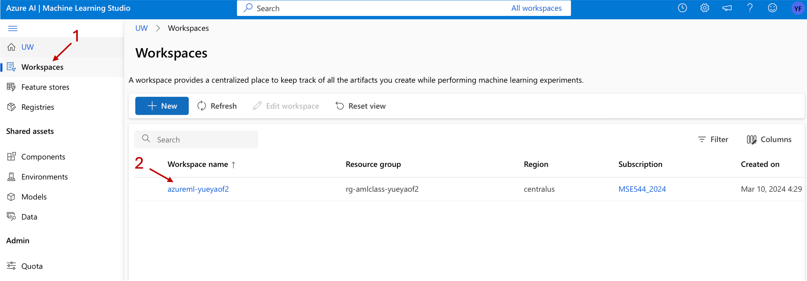

### Step A. Create a DataSet of molecular images  <a name="part2_stepa"></a>

Open your terminal and navigate to the folder you created (```MSE544_yolo_training```) in part 1. Tar the whole dataset in order to keep the data structure during upload.
```
tar -cvf molecule_images.tar ./molecule_images
```

Navigate back to your Home page of your Azure Machine Learning studio instance, choose ```Datasets``` from left side bar and then click ```+ Create``` on the right hand window. 

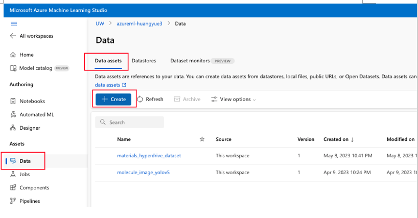

Fill in the basic information in the prompted window. In particular make sure to set the Dataset type to ```File```, then hit ```Next```

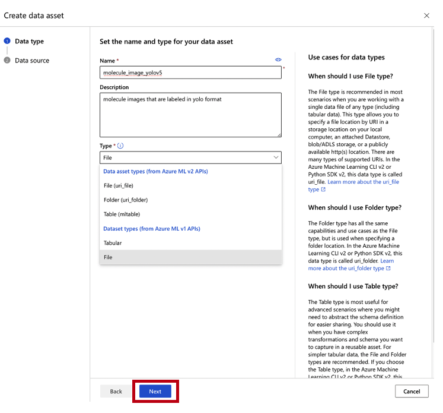

In the following page, choose From local files, and hit next 
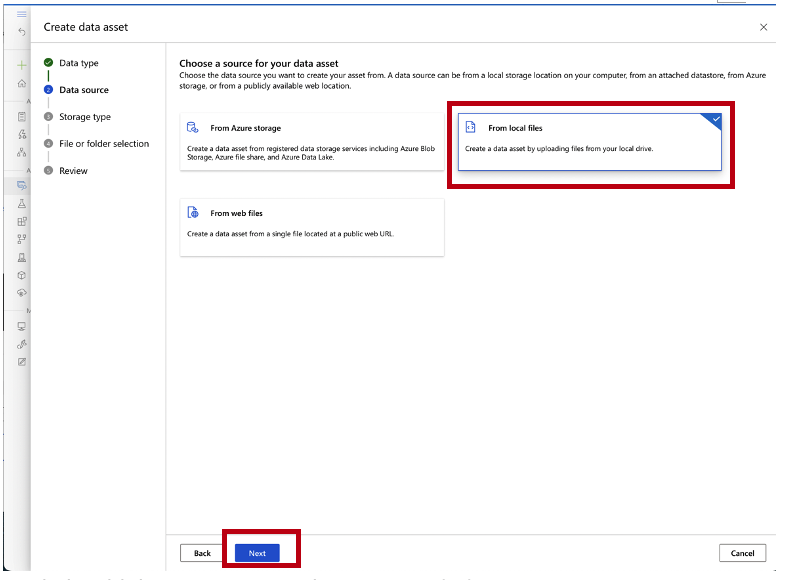

In the following page, choose the default datastore (typically called "Azure Blob Storage") that AML automatically creates with any workspace. Then select ``` workspaceblobstore```, the default datastore. You can click ```Next``` without select any datastore, it will be checked when you click "Back" later.)

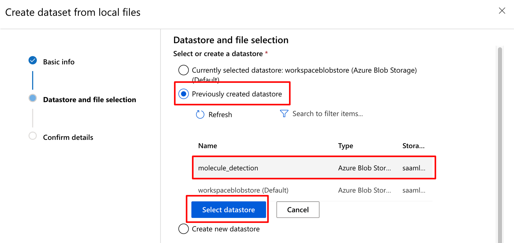

If default datastore does not work, you can create a new one referring to [troubleshooting link](https://github.com/lunayuehuang/MSE544_ObjectDetectionWithYoloV5/blob/main/troubleshooting.md).

Then click the ```Browse``` button in the ```Select files for your dataset``` section, and choose ```Browse files```:

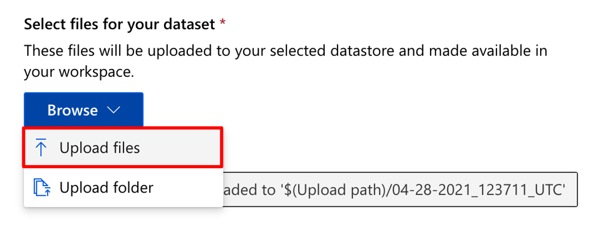

and select the tar file you made earlier ```molecule_image.tar```:

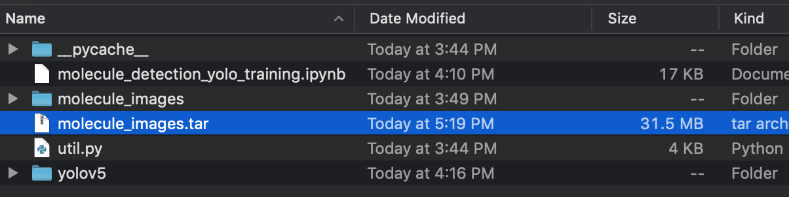

Click ```Next``` to start the upload:

Once the upload has completed, click ```Create``` in the summary page:

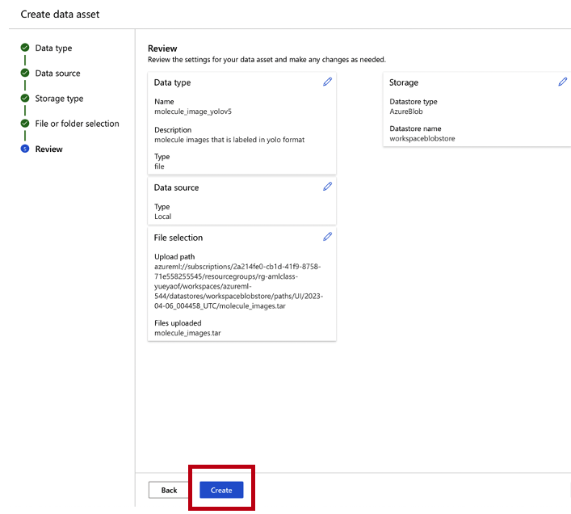

At this point, your AML dataset has successfully been created!

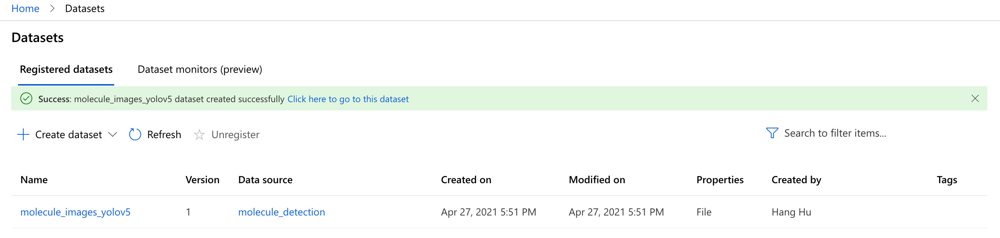

### Step B. Create a GPU Training Cluster <a name="part2_stepb"></a>
Navigate back to the home page of your Azure Machine Learning studio instance, and this time use ```Create new``` to create a ```Training cluster```

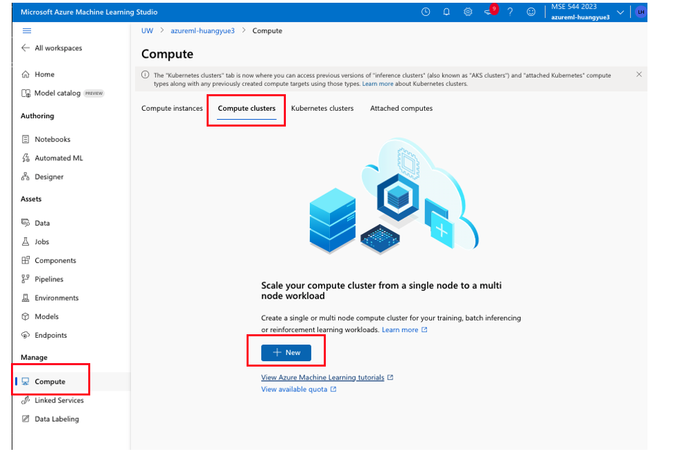

At the prompt, choose options: Location = ```"South Central US"```, VM priority = ```Dedicated VM```, VM type = ```GPU``` and VM Size = ```Standard_NC6s_v3```,  then click ```Next```. 

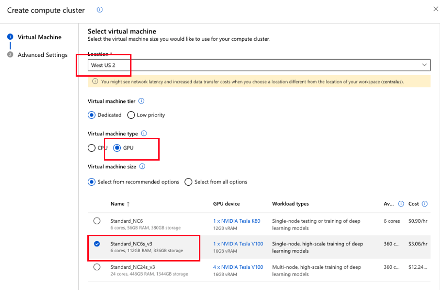

In the following page, name the GPU cluster as ```GPU-<your-uw-id>```, and set ```Idle seconds before scale down``` to ```120``` seconds. The other options may remain as per defaults. This will ensure that after a couple of minutes of inactivity, the cluster will deprovision the GPU, avoiding unnecessary costs. Then click ```Create```:

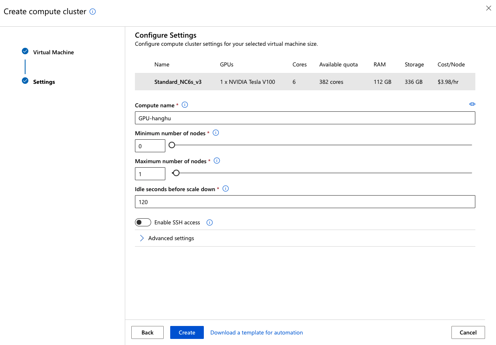

Your GPU cluster has now been successfully created:

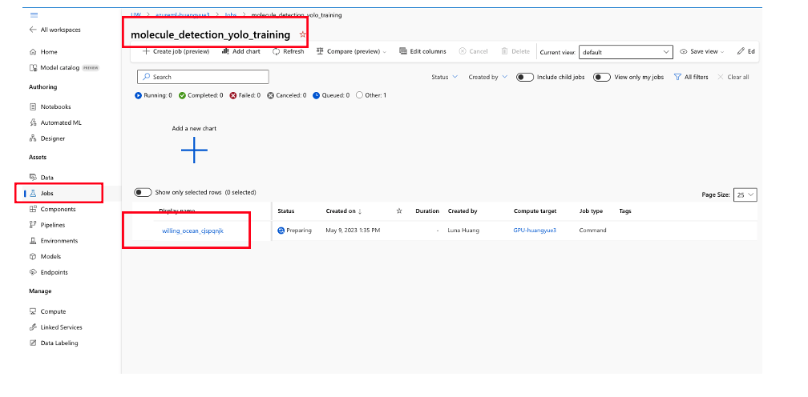

You can click into your GPU cluster to obtain the configuration information that will be used for submitting the jobs to it:

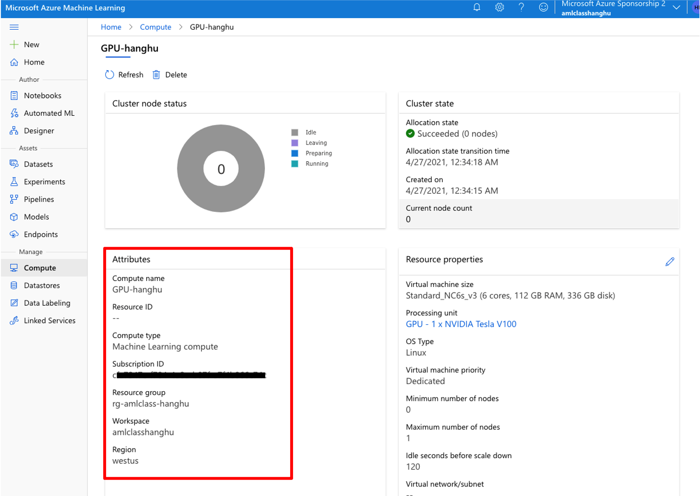


## Part 3 Train YoloV5 on Azure Machine Learning <a name="part3"></a>


### Step A. Set up configurations for training environment <a name="part3_stepa"></a>

Switch back to the notebook from part 1, and add a new cell and import helper functions from ```azureml.core```
```python
from azureml.core import Workspace, Experiment, Environment, ScriptRunConfig
from azureml.core.conda_dependencies import CondaDependencies
```

Define the python environment that will be used on the GPU cluster:
```python
yolov5_env = Environment(name="yolov5_env")

# Start from a base docker environments defined by Microsoft
yolov5_env.docker.base_image  = "mcr.microsoft.com/azureml/openmpi4.1.0-cuda11.0.3-cudnn8-ubuntu18.04"

conda_dep = CondaDependencies()
# Indicate which version of python needs to be installed
conda_dep.add_conda_package('python=3.9')

# install all the yolov5 requirement at the image build time
with open('./yolov5/requirements.txt', 'r') as f:
    line = f.readline()
    
    while line != '':    
        # If the line is a comment or empty, skip it    
        if line.startswith('#') or len(line.split()) == 0:
            line = f.readline()
            continue
        # Otherwise add the corresponding package name as a dependency
        conda_dep.add_pip_package(line.split()[0])
        # Then move on to the next line in the requirements.txt file
        line = f.readline()

yolov5_env.python.conda_dependencies=conda_dep
```

You can check the details of the enviroment you defined in a new cell using
```python
yolov5_env.get_image_details
```
And confirm that the python version is 3.9 or later from the output:
```python
...
            "dependencies": [
                "python=3.9",
                {
                    "pip": [
                        "azureml-defaults",
                        "matplotlib>=3.2.2",
                        "numpy>=1.18.5",
                        "opencv-python>=4.1.2",
                        "Pillow",
                        "PyYAML>=5.3.1",
                        "scipy>=1.4.1",
                        "torch>=1.7.0",
                        "torchvision>=0.8.1",
                        "tqdm>=4.41.0",
                        "tensorboard>=2.4.1",
                        "seaborn>=0.11.0",
                        "pandas",
                        "thop",
                        "pycocotools>=2.0"
                    ]
                }
            ],
...
```

### Step B. Create a training script <a name="part3_stepb"></a>
Open your terminal or use your GUI interface on your computer to navigate to the folder you created (```MSE544_yolo_training```) in part 1. Create a new subfolder (named ```deploy_yolo_training```), which will contain the training script that will be deployed to the GPU VM in Azure.
```
mkdir deploy_yolo_training
cd deploy_yolo_training
```  

Go into the new directory, and create a new file  named ```training_on_aml.py```, which will be the actual training script. 

Let's now copy the relevant processing steps into that script file:

- Connect to the datastore and download dataset
    - import necessary packages
    
    ```python
    # import necessary packages
    from azureml.core import Workspace, Dataset, Run
    import os, tempfile, tarfile, yaml
    ```
    
    - Create a temporary directory and download the molecule image dataset in that directory
    
    ```python
    # Make a temporary directory and mount molecule image dataset
    print("Create temporary directory...")
    mounted_path = './tmp'
    print('Temporary directory made at' + mounted_path)

    # Get the molecule dataset from the current workspace, and download it
    print("Fetching dataset")
    ws = Run.get_context().experiment.workspace
    dataset = Dataset.get_by_name(ws, name='molecule_image_yolov5')
    print("Download dataset")
    dataset.download(mounted_path,overwrite=True)
    print("Check that the tar file is there:")
    print(os.listdir(mounted_path))
    print("molecule_images dataset download done")
    ```
    
    - Untar files to the working directory
    
    ```python
    # untar all files under this directory, 
    for file in os.listdir(mounted_path):
        if file.endswith('.tar'):
            print(f"Found tar file: {file}")
            tar = tarfile.open(os.path.join(mounted_path, file))
            tar.extractall()
            tar.close()
    
    print("")
    print("Content of the molecule_images folder:")
    molecule_images_folder = os.path.join(".","molecule_images")
    print(os.listdir(molecule_images_folder))
    ```

- Set up yolov5 environment, very similar to part 1
    
    ```python
    # this is needed for container
    os.system('apt-get install -y python3-opencv')
    
    print("Current Directory:")
    print(os.getcwd())
    print()
    
    print("Cloning yolov5")
    os.system('git clone https://github.com/ultralytics/yolov5')
    print("Check content of '.' folder:")
    print(os.listdir('.'))

    # Let's check that pytorch recognizes the GPU
    import torch
    print(f"yolov5 enviroment setup complete. Using torch {torch.__version__} ({torch.cuda.get_device_properties(0).name if torch.cuda.is_available() else 'CPU'})")
    ```

- Create a yolov5 yaml file that will tell the main yolo training script where to find the training data

    ```python
    # Generate yaml config file for run on Azure GPU
    yolo_yaml = os.path.join('.', 'molecule_detection_yolov5.yaml')

    tag = 'molecule' 
    tags = [tag]
    with open(yolo_yaml, 'w') as yamlout:
        yaml.dump(
            {'train': os.path.join('../molecule_images','train'),
            'val': os.path.join('../molecule_images','val'),
            'nc': len(tags),
            'names': tags},
            yamlout,
            default_flow_style=None,
            sort_keys=False
        )

    # Let's copy the yaml file to the "./outputs" folder we well so we can find it in the logs of the experiment once it's complete
    os.system('cp ./molecule_detection_yolov5.yaml ./outputs/molecule_detection_yolov5.yaml')
    ```

-   Add training command and start training, using 100 epochs (remember: we only did a single epoch when using local machines)
    
    ```python
    os.system('python yolov5/train.py --img 640 --batch 16 --epochs 100 --data ./molecule_detection_yolov5.yaml --weights yolov5s.pt')
    ```

-   Inference test images using the best training weights
    
    ```python
    os.system('python yolov5/detect.py --weights ./yolov5/runs/train/exp/weights/best.pt --iou 0.05 --save-txt --source ./molecule_images/test/images/')
    ```

-   Copy the training and test results to ``./outputs`` of your work directory. Only in this way, the results can be saved and downloaded after job completion.
    
    ```python
    # Copy to the outputs folder so that the results get saved as part of the AML run
    os.system('cp -r ./yolov5/runs ./outputs/')
    ```
    
    Save your python training file and close it. 

### Step C. Submit the job and do the yolov5 training on cloud <a name="part3_stepc"></a>
Now swith back to the notebook again, and set up an Azure ML experiment. 
If you haven't, import the azureml.core classes 

```# import necessary packages
from azureml.core import Workspace, Experiment, Environment, ScriptRunConfig
from azureml.core.conda_dependencies import CondaDependencies
```
After import, add another cell and connect your notebook to your AML workspace: 
Here you need to modify the cell based on the configuration information you can see when you build your GPU cluster or from your AML workspace info. 
```python
subscription_id = '<your_subscription_id>'
resource_group  = '<your_resoure_group>'
workspace_name  = '<your_workspace_name>'
ws = Workspace(subscription_id, resource_group, workspace_name)

experiment = Experiment(workspace=ws, name='molecule_detection_yolo_training')
```

running this cell might prompt you to sign in to your AML using your UWID through browser.  

Then create a script run configurations as follows. All the field within each ```<>``` can be found at the end of Part 2 Step C and they need to be replaced with your own values before proceeding to next cell. 
This takes takes as input a ``source_directory`` which will be copied to the Azure VM and should contain your training script, a ``script`` which is the file name of your script in that source_directory which will be run automatically by Azure when the VM setup has completed, a ``compute_target`` which indicates which compute the script should be deployed to, and the ``environment`` which we defined earlier indicating what all needs to be installed on the VM as pre-requisites.
```python
# Overall configuration for the script to be run on the compute cluster
config = ScriptRunConfig(source_directory='./deploy_yolo_training/',   ## folder in which the script is located
                         script='training_on_aml.py',       ## script name
                         compute_target='<your-gpu-cluster-name>',
                         environment=yolov5_env)   
```

Check the running directory of your notebook by running
```python
os.getcwd()
```
and if you are not in folder ```MSE544_yolo_training```, switch to it by
```python
# make sure you are in the same folder of this notebook
%cd <path-to-MSE544_yolo_training>
```

Submit the job to the GPU cluster on Azure by executing the following commands in your notebook:
```python
run = experiment.submit(config)
aml_url = run.get_portal_url()
print(aml_url)
```

If the training job is successfully deployed, a url will be printed as output. Clicking the url will navigate you to the experiment you submitted on the Azure Machine Learning studio, where you can see its status. The first time you run it, Azure needs time to create the VM image that meets the requirements specified in the environment definition earlier, so for that initial run the status will show ```Preparing``` for about 20-30 minutes before it even starts allocating a node to execute your training script. Future runs that use the same environment configuration are going to be much faster. 


You can check your previous experiments runs on your Azure Machine Learning home page. On the left panel click ```Experiments``` > ```<your-experiment-names>``` > ```Run <id>```.

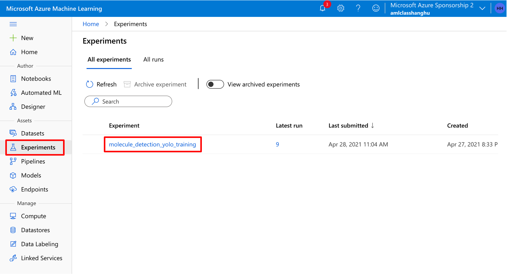
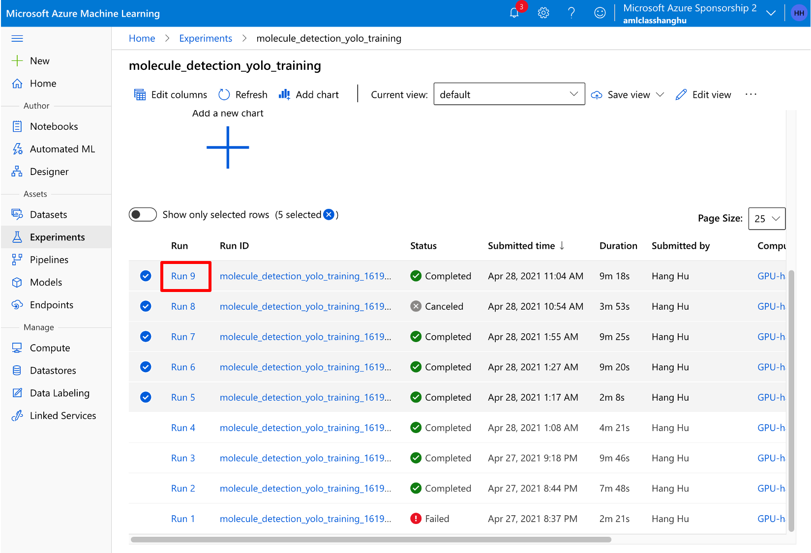

### Step D. Check the running logs and download outputs <a name="part3_stepd"></a>

On the experiment page, click ```Outputs + logs```：

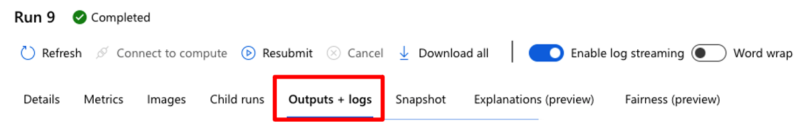

Then from on the left-hand panel you can get a preview of the logs and output files. Navigate to ```azureml-logs``` > ```user_logs/std_log.txt```. THat log file contains the system output from the job you submitted, and in particular all print statements from the training script are going to be found there. Scroll through this log until near the end, and make sure that you see ```100 epochs completed in ...``` and ```Results saved to runs/detect/exp```, which indicate that the training and inference are complete respectively. Double check on the left hand side panel again, unfold the ```outputs``` > ```runs``` directory, and make sure that both ```detect``` and ```train``` folders are there.  In the outputs/training/weights folder, you also can see P_curve, PR_curve, and R_curve, to review the performance of your training. 

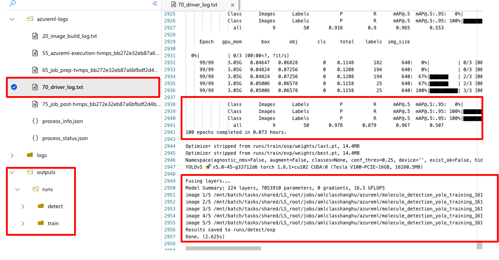

Now, you are ready to download the results (including training weights and inference labels) to your local machine by clicking ```Download all``` from the top panel. 

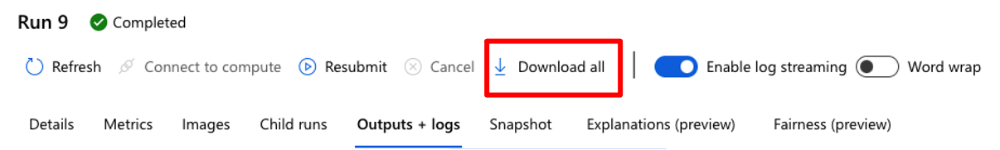

Choose the same folder ```MSE544_yolo_training``` for downloading the file (named ``Job_<run_name>_OutputsAndLogs.zip``), and unzip it. You will obtain a folder called ```Job_<Run_name>_OutputsAndLogs```: <run-name> is randomly generated strings instead of sequential numbers. 

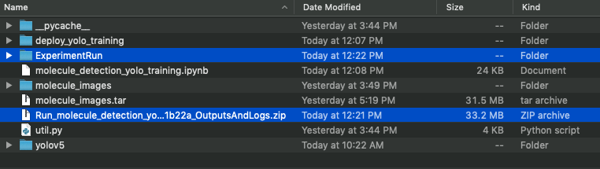

Go into that folder, then to the ``outputs/runs`` subfolder, and you can explore all the training and detection results. Within the ```train``` folder, there are plots of images with labels and metrics throughout the training. Most importantly there are ```weights``` resulting from the training that can be used for inference or more trainings in the future. Within the ```detect``` folder, there are plots of images with predicted labels and also the labels files for each image if you used ```--save-txt``` in your inference command.

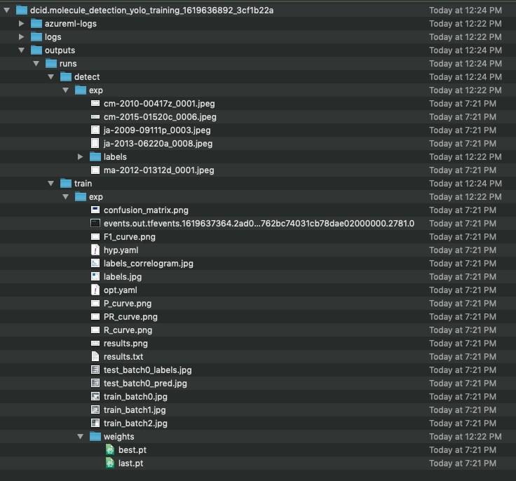

For example, one of the inference results, ```cm-2010-00417z_0001.jpeg```, is shown as:

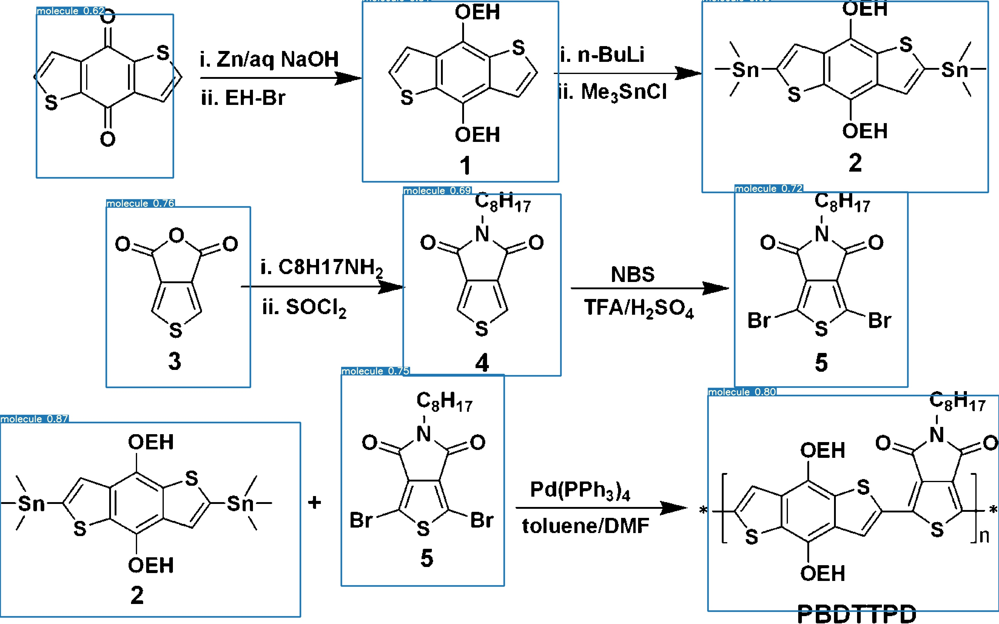

## Part 4. Inference using with YoloV5 weights on your local machine <a name="part4"></a>

Open your terminal, navigate to folder ```MSE544_yolo_training```. Copy the best weights (from file ```best.pt```) you got from the cloud to the current directory, and rename it as ```molecule_detection.pt```. Make sure to replace ```<RunName>``` with the name of the experiment run that you want to use.
```
cp ./Run_<RunName>_OutputsAndLogs/outputs/runs/train/exp/weights/best.pt ./molecule_detection.pt
```

To run an inference, simply use the same command you used in your script, specifying where to find the weights and images on which you want to detect molecules. Make sure you have activated your yolov5 conda environment using command ```conda activate yolov5```. Depending on your setup, you may need to use command ``python3`` or ``python``.
```
python ./yolov5/detect.py --weights molecule_detection.pt --iou 0.05 --save-txt --source ./molecule_images/test/images 
```

Note that you can switch to different models by changing the weight file after ```--weights``` and different test sets by changing the image source folder after ```--source```.

The results of your inference will be located at ```./yolov5/runs/detect/exp```, and checking results will be the same as the instructions of part 3 step D.

## Reference and Further Reading <a name="reference"></a>

[https://github.com/ultralytics/yolov5/wiki/Train-Custom-Data](https://github.com/ultralytics/yolov5/wiki/Train-Custom-Data)

[https://github.com/ultralytics/yolov5/wiki/Tips-for-Best-Training-Results](https://github.com/ultralytics/yolov5/wiki/Tips-for-Best-Training-Results)

[https://medium.com/analytics-vidhya/you-only-look-once-yolo-implementing-yolo-in-less-than-30-lines-of-python-code-97fb9835bfd2](https://medium.com/analytics-vidhya/you-only-look-once-yolo-implementing-yolo-in-less-than-30-lines-of-python-code-97fb9835bfd2)


