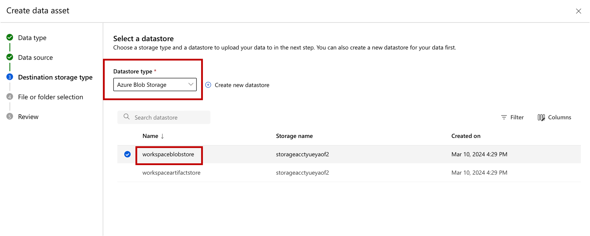
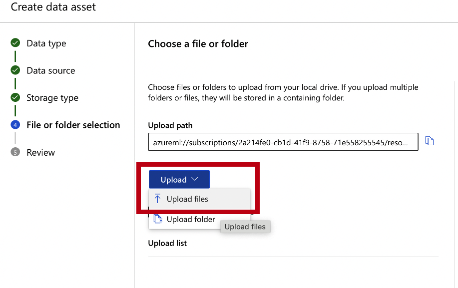
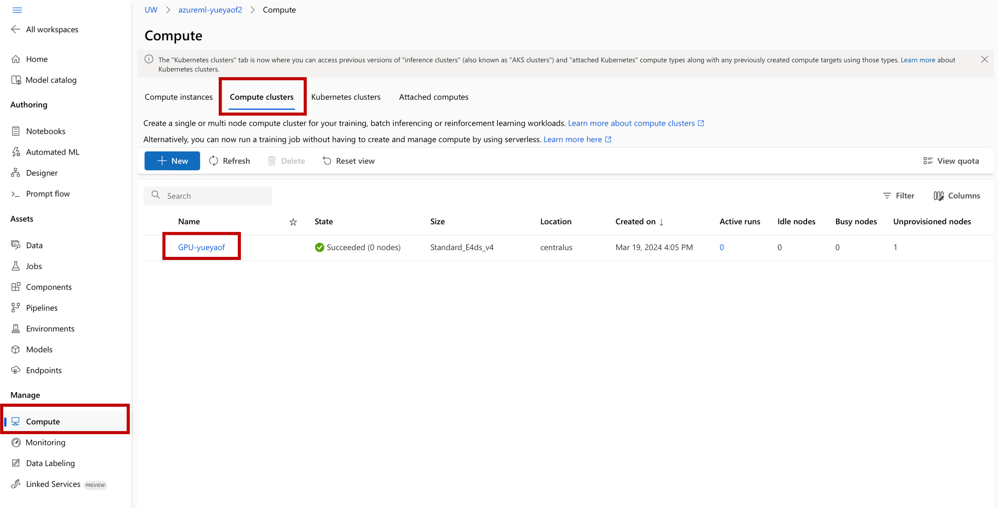

# MSE544 Object Detection With YoloV5

## Part 1 How to train and run YoloV5 on local machines

### Step A. Get YoloV5 an set up python environment

Open your terminal and make a new directory named ```MSE544_yolo_training```(or names that you like). Switch into the directory and then clone the yolo repository from GitHub:
```
git clone https://github.com/ultralytics/yolov5
```

Make a new conda enviroment with python 3.8 or later and install the required packages
```
# create conda environment
conda create -n yolov5 python=3.8 jupyter notebook
conda activate yolov5

cd yolov5 
pip install -r requirements.txt  # packages required by yolov5
pip install sklearn scikit-image azureml-core # other packages used in this tutorial 
```

### Step B. Prepare Yolo labels

Locate the repository (https://github.com/lunayuehuang/Mse544-CustomVision) from Monday's class or clone it if you haven't done so. In the rest of this tutorial, the path of Monday's repository will refer as ```<path-to-Mse544-CustomVision>```, which will be replaced by the real path on your computer. 

Go out of the ```yolov5``` folder (back to ```MSE544_yolo_training```) and copy a file ```util.py``` from ```<path-to-Mse544-CustomVision>``` to current one.
```
cd <path-to-MSE544_yolo_training>
cp <path-to-Mse544-CustomVision>/util.py .
```

Now, start a fresh jupyter notebook, named by ```molecule_detection_yolo_training.ipynb```. In the first cell import the utility functions:
```
from util import labeledImage, normalize_coordinates, convert_to_yolo_format
from sklearn.model_selection import train_test_split
import os, shutil, yaml
```

Then use the helper class we have from Monday ```labeledImage``` to load all the labels that produced by ImageJ:
```
source_images_dir = '<path-to-Mse544-CustomVision>/molecules/'
source_labels_dir = '<path-to-Mse544-CustomVision>/molecules/labels/'

labeled_images = []
tag = 'molecule' 

for file in os.listdir(source_images_dir):
    # find all jpeg file and it's ImageJ label
    if file.endswith(".jpeg"):
        image_path = os.path.join(source_images_dir, file)
        label_path = os.path.join(source_labels_dir, file.split('.')[0] + '.txt')
        labeled_images.append(labeledImage(image_path))
        labeled_images[-1].add_labels_from_file(tag, label_path)
```

In next cell. let's split the labled images as training, validation and testing. Normally the ratio of them is 7:2:1.
```
train_and_val_set, test_set = train_test_split(labeled_images, test_size=0.1)
train_set, val_set = train_test_split(train_and_val_set, test_size=(2/9))

len(train_set), len(val_set), len(test_set)
```

The output of this cell will show the size of training, valiation and testing set. Particularly, for this example, it's
```
(35, 10, 5)
```

Before pouring the images and labels, let's create our data directory hierarchy as
```
|---image_data
    |---training.yaml
    |---train
        |---images
        |---labels
    |---val
        |---images
        |---labels
    |---test
        |---images
        |---lables
```
where ```training.yaml``` is a configuration file for yolo that stores all the parameters information needed by yolov5. Run the following code in your notebook will produce such data structure, and ```molecule_images``` is used for the name of this image dataset.

```
# making directories
output_dir = './molecule_images'

if not os.path.exists(output_dir): os.mkdir(output_dir)

train_dir = os.path.join(output_dir, 'train') 
val_dir   = os.path.join(output_dir, 'val') 
test_dir  = os.path.join(output_dir, 'test') 

for d in [train_dir, val_dir, test_dir]:
    if not os.path.exists(d): os.mkdir(d)
    
    images_sub_dir = os.path.join(d, 'images')
    labels_sub_dir = os.path.join(d, 'labels')
    
    for sub_dir in [images_sub_dir, labels_sub_dir]:
        if not os.path.exists(sub_dir): os.mkdir(sub_dir)
```
Now, it's ready to copy over all the images file and convert all the ImageJ labels into yolo format:
```
# make unified yolo tags 
tags = [tag]

# zip the dataset
dataset = [(train_dir, train_set),(val_dir, val_set),(test_dir, test_set)]

for d, s in dataset:
    images_sub_dir = os.path.join(d, 'images')
    labels_sub_dir = os.path.join(d, 'labels')

    # copy over the images
    for img in s:
        shutil.copyfile(img.path, os.path.join(images_sub_dir, img.name))
    
    # covert ImageJ labels to yolo format and save it to labels_sub_dir
    convert_to_yolo_format(s, labels_sub_dir, tags)
```
The last step is to generate a configuration file for training:
```
# generate yolo yaml file
yolo_yaml = os.path.join(output_dir, 'molecule_detection_yolov5.yaml')

with open(yolo_yaml, 'w') as yamlout:
    yaml.dump(
        {'train': train_dir,
         'val': val_dir,
         'nc': len(tags),
         'names': tags},
        yamlout,
        default_flow_style=None,
        sort_keys=False
    )
```
### Step C. Training the YoloV5 modle on local machines    
With all the label prepared, you can try to train a few epoch on your local machine by simpily go into ```yolov5``` folder:
```
%cd yolov5
```
and then run the training command:
```
!python train.py --img 640 --batch 16 --epochs 1 --data ../molecule_images/molecule_detection_yolov5.yaml --weights yolov5s.pt
```
As you might noticed that, training yolov5 model on your local machine is very slow, where the GPU training cluster on Azure Machine Learing could be used to speed up our training. 

The logs of your training is will be located at ```yolov5/runs/train/exp*```.

### Step D. Inference using YoloV5

For this step, you can either download a pre-trained weights from this git repository(FIXME:comming soon), or wait until the end when you obtain a weights form cloud training.

To run test, simply use the following command under yolov5 directory:
```
!python test.py --weights test_weights.pt --data ../molecule_images/test/images --iou 0.80
```

The results of your inference is will be located at ```yolov5/runs/test/exp*```

## Part 2 Create GPU training clusters and prepare training on Azure Machine Learning

In order to train yolov5 on Azure GPU training clusters, you need to also create datasets that can be accessed by the clusters during training. The first two steps are intended to create data storage and upload the molecule dataset to cloud.

First of all, go to Azure Machine Learning portal and sign in with UW account.Then choose the resource group for this class (named as ```rg-amlclass-<your-uw-id>```), and you will find a Azure Machine Learning Studio resource named as ```amlclass<your-uwid>```: 


Click that resources, and in the following page click ```Launch studio```, you will be navigated to Azure Machine Learning Studio Home page. Also note that you can find the your storage account under this page, which you will be used for creating datastores.


### Step A. Create a DataStore
Go to your Azure Machine Learning Studio Home page and selete ```Create new```, in the scrolled list, select ```Datastore```


In the prompted file, fill in all the fields other than ```SAS token``` as this:


For ```SAS token```, go back to your resource group page, select and click the corresponding storage account used by Machine Learning studio:


In the left side bar of the following page, search ```sas```, and then choose ```Shared access signature```


Once the right side is prompted, select all of the ```Allowed resource types```, double check the ```start and epiry data/time``` to make sure it cover the range of this tutorial. Then click ```Generate SAS and connection string``` 


The SAS token should be sucessfully generated at the end of this page:


Copy the ```SAS token``` and paste it back to previous datastore creation, and click ```Create```. Then you will successfully created a datastore:


### Step B. Create a DataSets of molecule images

Open your terminal and navigate to the folder you created (```MSE544_yolo_training```) in part 1. Tar the whole dataset in order to keep the data structure during upload.
```
tar -cvf molecule_images.tar ./molecule_images
```

Navigate back to your Home page of your Azure Machine Learning studio, choose ```Datasets``` from left side bar and then click ```+ Create dataset``` at the right window. Choose ```From local files``` in the scoll-up list.


Fill in the basic information in the prompted window and go ```Next```


In the following page, choose the one datastore you created in last step within ```previous created datastore``` and then click ```Select datastore```


Then click ```Browse```, in the scrolled list, choose ```Upload files```:


and select the tar file you made earlier ```molecule_image.tar```:


Click ```Next``` to initialize the uploading:


Once the uploading is finished, click ```Create``` in the summary page:


And a dataset is successfully created.


### Step C. Create a GPU Training Cluster
Navigate back to your home page of your Azure Machine Learning studio, and this time use ```Create new``` to create a ```Training cluster```
And a dataset is successfully created.


In the prompted window, choose options as this screenshot, and then click ```Next``` 


In the following page, name the GPU cluster as ```GPU-<your-uw-id>```, and set ```Idle seconds before scale down``` as ```120``` seconds. The other options remains as defaults. Then click ```Create```:


Then you GPU cluster will be succussfully created:


You can click the into your GPU cluster to obtain the configuration information that will be used for submitting the jobs:
Then you GPU cluster will be succussfully created:


## Part 3 Train YoloV5 on Azure Machine Learning

### Step A. Set up training environment

### Step B. Create a training script

### Step C. Submit the job and do the yolov5 training on cloud

### Step D. Check the running logs and download the weights

## Reference


