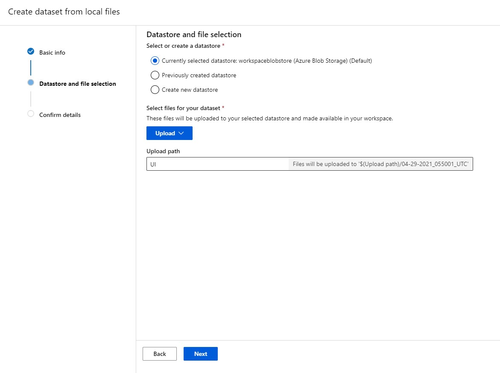
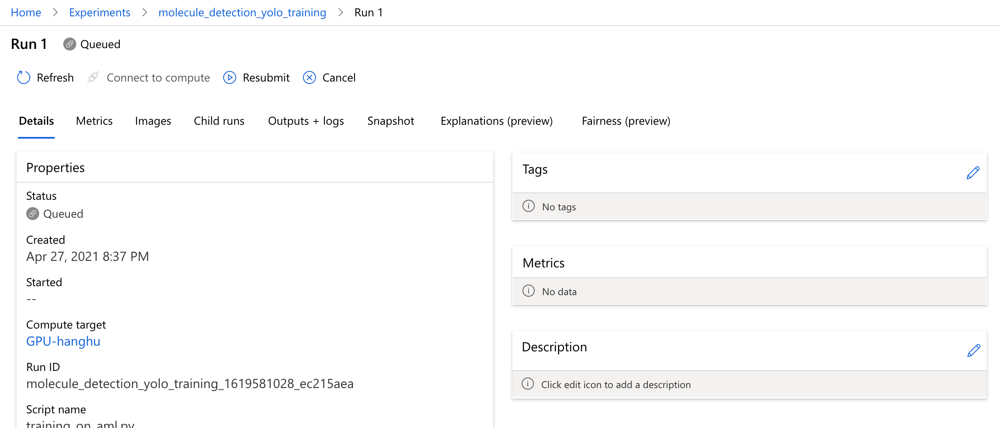
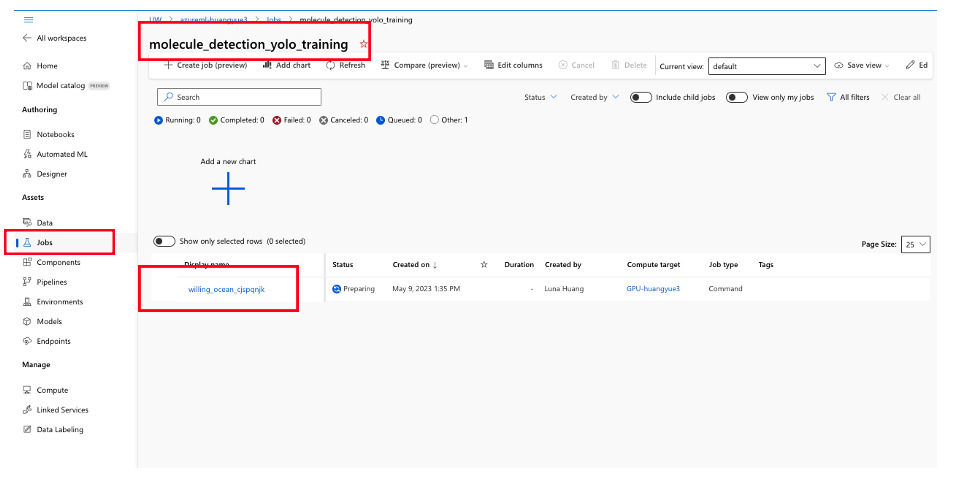
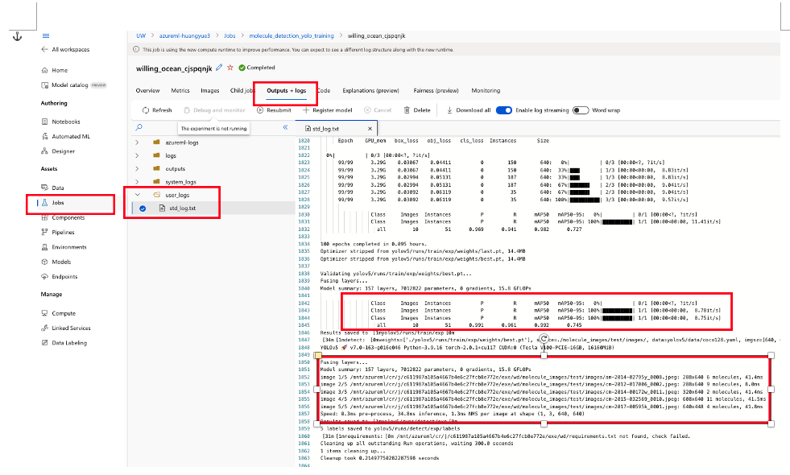
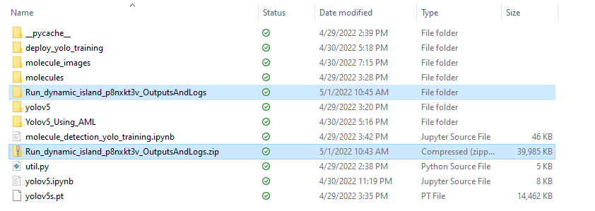
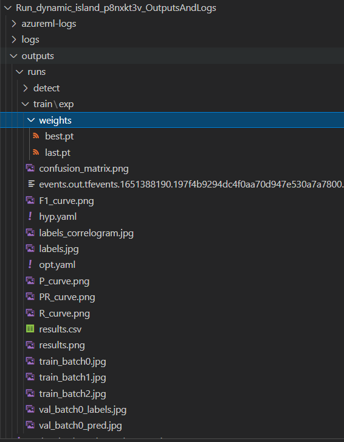

# MSE544 Object Detection With YoloV5

Author: [Hang Hu](https://github.com/hanghu) & [Luna Huang](https://github.com/lunayuehuang) 

## Table of Contents

- [Part 1 How to train and run YoloV5 on local machines](#part1)
  - [Step A. Get YoloV5 and set up python environment](#part1_stepa) 
  - [Step B. Prepare Yolo labels](#part1_stepb) 
  - [Step C. Training the YoloV5 model on local machines](#part1_stepc) 
- [Part 2 Create GPU training clusters and prepare training on Azure Machine Learning](#part2)
  - [Step A. Create a DataSet of molecular images](#part2_stepa) 
  - [Step B.  Create a GPU Training Cluster](#part2_stepb)
- [Part 3 Train YoloV5 on Azure Machine Learning](#part3)
  - [Step A. Set up configurations for training environment](#part3_stepa)
  - [Step B. Create a training script](#part3_stepb)
  - [Step C. Submit the job and do the yolov5 training on cloud](#part3_stepc)
  - [Step D. Check the running logs and download outputs](#part3_stepd)
- [Part 4. Inference using with YoloV5 weights on your local machine](#part4)
- [Reference and Further Reading](#reference)

## Part 1 How to train and run YoloV5 on local machines <a name="part1"></a>

### Step A. Get YoloV5 and set up python environment <a name="part1_stepa"></a>

Open your terminal and make a new directory named ```MSE544_yolo_training```(or any other name of your choice). Switch into the directory and then clone the yolo repository from GitHub:
```
git clone https://github.com/ultralytics/yolov5
```

Create a new conda enviroment with python 3.8 or later and install the required packages for Yolo; for that, copy the below in a terminal window then hit ```enter```:
``` 
conda create -n yolov5 python=3.8 jupyter notebook
conda activate yolov5
```

Now that we're done creating that virtual environment, let's create a new jupyter notebook named  ```molecule_detection_yolo_training.ipynb```.

Once the notebook is open, make sure that the "yolov5" environment is selected for it. If not, switch to it. In case you do not see it in the list of available environments, try to reload the developer window (Command+Shift+P on Mac, or Ctrl+Shift+P on Windows, then type "reload" in the search box, and find "Developer: reload window" command). 


In the first cell of the notebook, we'll install the requirements to complete this tutorial. Copy the following, then execute it
```
%pip install -r yolov5/requirements.txt 
%pip install sklearn scikit-image azureml-core
```
If you are PC user, you might need to run command if you are not in the administrator account 

```
%pip install -r yolov5/requirements.txt --user
%pip install sklearn scikit-image azureml-core --user
```

### Step B. Prepare Yolo labels  <a name="part1_stepb"></a>

Locate the repository (https://github.com/lunayuehuang/Mse544-CustomVision) from Monday's class or clone it if you haven't done so. In the rest of this tutorial, the path of Monday's repository will refer as ```<path-to-Mse544-CustomVision>```, which will be replaced by the real path on your computer. 

Copy the file ```util.py``` from ```<path-to-Mse544-CustomVision>``` to the current folder. Use Finder or Windows explorer do do this; or if you prefer command line, use the following:
``` 
cd <path-to-MSE544_yolo_training>
cp <path-to-Mse544-CustomVision>/util.py .
```

In the next cell of the notebook, import the utility functions:
```python
from util import labeledImage, normalize_coordinates, convert_to_yolo_format
from sklearn.model_selection import train_test_split
import os, shutil, yaml
```

Then use the helper class we have from Monday ```labeledImage``` to load all the labels that were produced by ImageJ:
```python
source_images_dir = '<path-to-Mse544-CustomVision>/molecules/'
source_labels_dir = '<path-to-Mse544-CustomVision>/molecules/labels/'

labeled_images = []
tag = 'molecule' 

for file in os.listdir(source_images_dir):
    # find all jpeg file and it's ImageJ label
    if file.endswith(".jpeg"):
        image_path = os.path.join(source_images_dir, file)
        label_path = os.path.join(source_labels_dir, file.split('.')[0] + '.txt')
        labeled_images.append(labeledImage(image_path))
        labeled_images[-1].add_labels_from_file(tag, label_path)
```

In the next cell, let's split the labeled images into training, validation and testing sets. A typical split ratio to use is 7:2:1, and we can use Keras' '''train_test_split()''' function for this.
```python
train_and_val_set, test_set = train_test_split(labeled_images, test_size=0.1)
train_set, val_set = train_test_split(train_and_val_set, test_size=(2/9))

len(train_set), len(val_set), len(test_set)
```

The output of this cell will show the size of training, validation and testing sets. For this example, the output is:
```python
(35, 10, 5)
```

Next, we will organize our data directory hierarchy as:
```
|---image_data
    |---training.yaml
    |---train
        |---images
        |---labels
    |---val
        |---images
        |---labels
    |---test
        |---images
        |---lables
```
where ```training.yaml``` is a configuration file for yolo that stores all the parameters information needed by yolov5. Running the following code in your notebook will produce such data structure in a base directory named ```molecule_images```.

```python
# Create the molecule_images directory if it doesn't exist
output_dir = './molecule_images'
if not os.path.exists(output_dir): os.mkdir(output_dir)

train_dir = os.path.join(output_dir, 'train') 
val_dir   = os.path.join(output_dir, 'val') 
test_dir  = os.path.join(output_dir, 'test') 

# Create the sub-directories
for d in [train_dir, val_dir, test_dir]:
    if not os.path.exists(d): os.mkdir(d)
    
    images_sub_dir = os.path.join(d, 'images')
    labels_sub_dir = os.path.join(d, 'labels')
    
    for sub_dir in [images_sub_dir, labels_sub_dir]:
        if not os.path.exists(sub_dir): os.mkdir(sub_dir)
```
Now we're ready to copy over all the images to the right sub-folders, and convert all ImageJ labels files into yolo format:
```python
# make unified yolo tags 
tags = [tag]

# zip the dataset
dataset = [(train_dir, train_set),(val_dir, val_set),(test_dir, test_set)]

for d, s in dataset:
    images_sub_dir = os.path.join(d, 'images')
    labels_sub_dir = os.path.join(d, 'labels')

    # copy over the images
    for img in s:
        shutil.copyfile(img.path, os.path.join(images_sub_dir, img.name))
    
    # covert ImageJ labels to yolo format and save it to labels_sub_dir
    convert_to_yolo_format(s, labels_sub_dir, tags)
```
The last step is to generate a yaml configuration file for training. Yolo will read this configuration file to figure out where to find the training and validation datasets, and what the tags (objects to be detected) are:
```python
# generate yolo yaml file
yolo_yaml = os.path.join(output_dir, 'molecule_detection_yolov5.yaml')

with open(yolo_yaml, 'w') as yamlout:
    yaml.dump(
        {'train': train_dir,
         'val': val_dir,
         'nc': len(tags),
         'names': tags},
        yamlout,
        default_flow_style=None,
        sort_keys=False
    )
```
### Step C. Training the YoloV5 model on local machines  <a name="part1_stepc"></a>
With all the labels prepared, you can try to train a few epochs on your local machine:
In your python notebook, run the following command in the next cell:
```python
%run yolov5/train.py --img 640 --batch 16 --epochs 1 --data ./molecule_images/molecule_detection_yolov5.yaml --weights yolov5s.pt
```
The logs of your training is will be located at ```yolov5/runs/train/exp*```.

As you might notice, training yolov5 model on your local machine can be very slow; because of this, we will try to use GPU machines in a compute cluster on Azure Machine Learning to speed up our training. 


## Part 2 Create GPU training clusters and prepare training on Azure Machine Learning  <a name="part2"></a>

In order to train yolov5 on Azure GPU training clusters, you need to also create an AML (Azure Machine Learning) dataset that can be accessed by the cluster during training. The first step is intended to create the molecule dataset in the AML workspace.

First of all, go to Azure Machine Learning portal (https://ml.azure.com) and sign in with your UW account. 
At the top right of the window, select the dropdown to change workspace, and set the current workspace to your own (named ```aml-amlclass-<uwid>```).


### Step A. Create a DataSet of molecular images  <a name="part2_stepa"></a>

Open your terminal and navigate to the folder you created (```MSE544_yolo_training```) in part 1. Tar the whole dataset in order to keep the data structure during upload.
```
tar -cvf molecule_images.tar ./molecule_images
```

Navigate back to your Home page of your Azure Machine Learning studio instance, choose ```Datasets``` from left side bar and then click ```+ Create dataset``` on the right hand window. Choose ```From local files``` in the list.


Fill in the basic information in the prompted window. In particular make sure to set the Dataset type to ```File```, then hit ```Next```


In the following page, choose the default datastore (typically called "workspaceblobstore") that AML automatically creates with any workspace.



Then click the ```Upload``` button in the ```Select files for your dataset``` section, and choose ```Upload files```:


and select the tar file you made earlier ```molecule_image.tar```:


Click ```Next``` to start the upload:


Once the upload has completed, click ```Create``` in the summary page:


At this point, your AML dataset has successfully been created!


### Step B. Create a GPU Training Cluster <a name="part2_stepb"></a>
Navigate back to the home page of your Azure Machine Learning studio instance, and this time use ```Create new``` to create a ```Training cluster```


At the prompt, choose options as indicated in the following screenshot, and then click ```Next``` 


In the following page, name the GPU cluster as ```GPU-<your-uw-id>```, and set ```Idle seconds before scale down``` to ```120``` seconds. The other options may remain as per defaults. Then click ```Create```:


Your GPU cluster has now been succussfully created:


You can click into your GPU cluster to obtain the configuration information that will be used for submitting the jobs to it:


## Part 3 Train YoloV5 on Azure Machine Learning <a name="part3"></a>


### Step A. Set up configurations for training environment <a name="part3_stepa"></a>

Switch back to the notebook from part 1, and add a new cell and import helper functions from ```azureml.core```
```python
from azureml.core import Workspace, Experiment, Environment, ScriptRunConfig
from azureml.core.conda_dependencies import CondaDependencies
```

Define the python environment on GPU cluster:
```python
yolov5_env = Environment(name="yolov5_env")

yolov5_env.docker.base_image  = "mcr.microsoft.com/azureml/openmpi4.1.0-cuda11.0.3-cudnn8-ubuntu18.04"

conda_dep = CondaDependencies()
conda_dep.add_conda_package('python=3.8')

# install all the yolov5 requirement at the image build time
with open('./yolov5/requirements.txt', 'r') as f:
    line = f.readline()
    
    while line != '':        
        if line.startswith('#') or len(line.split()) == 0:
            line = f.readline()
            continue
        
        conda_dep.add_pip_package(line.split()[0])
        line = f.readline()

yolov5_env.python.conda_dependencies=conda_dep
```

you can check the details of the enviroment you defined in a new cell using
```python
yolov5_env.get_image_details
```

And confirm that the python version is 3.8 or later from the output:
```python
...
            "dependencies": [
                "python=3.8",
                {
                    "pip": [
                        "azureml-defaults",
                        "matplotlib>=3.2.2",
                        "numpy>=1.18.5",
                        "opencv-python>=4.1.2",
                        "Pillow",
                        "PyYAML>=5.3.1",
                        "scipy>=1.4.1",
                        "torch>=1.7.0",
                        "torchvision>=0.8.1",
                        "tqdm>=4.41.0",
                        "tensorboard>=2.4.1",
                        "seaborn>=0.11.0",
                        "pandas",
                        "thop",
                        "pycocotools>=2.0"
                    ]
                }
            ],
...
```

### Step B. Create a training script <a name="part3_stepb"></a>
Open your terminal or use your GUI interface on your computer to navigate to the folder you created (```MSE544_yolo_training```) in part 1. Create a new folder (named by ```deploy_yolo_training```), which will be upload to Azure and used as the working directory.
```
mkdir deploy_yolo_training
```  

Go into the new directory, and create a python training script named as ```training_on_aml.py```

Open the file and create the script using the following steps:

- Connect to the datastore and download dataset
    - import necessary packages
    
    ```python
    # import necessary packages
    from azureml.core import Workspace, Dataset, Run
    import os, tempfile, tarfile
    ```
    
    - Create a temporary directory and download the molecule image dataset
    
    ```python
    # Make a temporary directory and mount molecule image dataset
    print("Create temporary directory...")
    mounted_path = './tmp'
    print('Temporary directory made at' + mounted_path)

    # Get the molecule dataset and download it
    print("Fetching dataset")
    ws = Run.get_context().experiment.workspace
    dataset = Dataset.get_by_name(ws, name='molecule_images_yolov5')
    print("Download dataset")
    dataset.download(mounted_path,overwrite=True)
    print("Check that the tar file is there:")
    print(os.listdir(mounted_path))
    print("molecule_images dataset download done")
    ```
    
    - Untar files to the working directory
    
    ```python
    # untar all files under this directory, 
    for file in os.listdir(mounted_path):
        if file.endswith('.tar'):
            print("Found tar file:")
            print(file)
            tar = tarfile.open(os.path.join(mounted_path, file))
            tar.extractall()
            tar.close()
    
    print("")
    print("Check the molecule_images folder content")
    print(os.listdir(os.path.join(".","molecule_images")))
    ```

- Set up yolov5 environment, very similar to part 1
    
    ```python
    # this is needed for container
    os.system('apt-get install -y python3-opencv')
    
    print("Cloning yolov5")
    os.system('git clone https://github.com/ultralytics/yolov5')

    # check GPU
    import torch
    print(f"yolov5 enviroment setup complete. Using torch {torch.__version__} ({torch.cuda.get_device_properties(0).name if torch.cuda.is_available() else 'CPU'})")
    ```

-   Add training command and start training, using 100 epochs
    
    ```python
    os.system('python yolov5/train.py --img 640 --batch 16 --epochs 100 --data ./molecule_images/molecule_detection_yolov5.yaml --weights yolov5s.pt')
    ```

-   Inference test images using the best training weights
    
    ```python
    os.system('python yolov5/detect.py --weights ./runs/train/exp/weights/best.pt --iou 0.05 --save-txt --source ./molecule_images/test/images/')
    ```

-   Copy the training and test results to ``./outputs`` of your work directory. Only in this way, the results can be saved and downloaded after job completion.
    
    ```python
    # Copy to the outputs folder so that the results get saved as part of the AML run
    os.system('cp -r ./runs ./outputs/')
    ```
    
    Save your python training file and close it. 

### Step C. Submit the job and do the yolov5 training on cloud <a name="part3_stepc"></a>
Now swith back to the notebook again, and set up an Azure ML experiment. Copy the values from your AML workspace. 
```python
subscription_id = '<your_subscription_id>'
resource_group  = '<your_resoure_group>'
workspace_name  = '<your_workspace_name>'
ws = Workspace(subscription_id, resource_group, workspace_name)

experiment = Experiment(workspace=ws, name='molecule_detection_yolo_training')
```

Then create script run configurations as follows. All the field within each ```<>``` can be found at the end of Part 2 Step C and they need to be replaced with your own values before proceeding to next cell. 
```python
# Overall configuration for the script to be run on the compute cluster
config = ScriptRunConfig(source_directory='./deploy_yolo_training/',   ## folder in which the script is located
                         script='training_on_aml.py',       ## script name
                         compute_target='<your-gpu-cluster-name>',
                         environment=yolov5_env)   
```

Check the running directory of your notebook by 
```python
%pwd
```
and if you are not in folder ```MSE544_yolo_training```, switch to it by
```python
# make sure you are in the same folder of this notebook
%cd <path-to-MSE544_yolo_training>
```

Submit the job to the GPU cluster on Azure by executing the following commands in your notebook:
```python
run = experiment.submit(config)
aml_url = run.get_portal_url()
print(aml_url)
```

If the training job is successfully deployed, a url will be printed as output. Clicking the url will navigate you to the experiment you submitted on the Azure Machine Learning studio, where you can see its status. The first time you run it, Azure needs time to create the VM image that meets the requirements specified in the environment definition earlier, so for that initial run the status will show ```Preparing``` for about 20-30 minutes before it even starts allocating a node to execute your training script. Future runs that use the same environment configuration are going to be much faster. 



You can check your previous experiments runs on your Azure Machine Learning home page. On the left panel click ```Experiments``` > ```<your-experiment-names>``` > ```Run <id>```.




### Step D. Check the running logs and download outputs <a name="part3_stepd"></a>

On the experiment page, click ```Outputs + logs```：


Then from on the left-hand panel you can get a preview of the logs and output files. Navigate to ```azureml-logs``` > ```70_driver_log.txt```. THat log file contains the system output from the job you submitted, and in particular all print statements are going to be found there. Scroll through this log until near the end, and make sure that you see ```100 epochs completed in ...``` and ```Results saved to runs/detect/exp```, which indicate that the training and inference are complete respectively.Double check on the left hand side panel again, unfold the ```outputs``` > ```runs``` directory, and make sure that both ```detect``` and ```train``` are copied there.  



Now, you are ready to download the results (including training weights and inference labels) to your local machine by clicking ```Download all``` from the top panel. 


Choose the same folder ```MSE544_yolo_training``` for downloading the file, and unzip it. You will obtain a folder called ```ExperimentRun```:



Go into that folder, and you can explore all the training and detection results. Within the ```train``` folder, there are plots of images with labels and metrics throughout the training. Most importantly there are ```weights``` that can be used for inference or more trainings in the future. Within the ```detect``` folder, there are plots of images with predicted labels and also the labels files for each image if you used ```--save-txt``` in your inference command.



For example, one of the inference results, ```cm-2010-00417z_0001.jpeg```, is shown as:


## Part 4. Inference using with YoloV5 weights on your local machine <a name="part4"></a>

Open your terminal, navigate to folder ```MSE544_yolo_training```. Copy the best weights (from file ```best.pt```) you got from the cloud to ```./yolov5/weights/```, and rename it as ```molecule_detection.pt```. Make sure to replace ```<exp-id>``` with the runId that you want to use
```
cp ./ExperimentRun/<exp-id>/outputs/runs/train/weights/best.pt ./yolov5/weights/molecule_detection.pt
```

To run an inference, simply use the same command you used in your script, specifying where to find the weights and images on which you want to detect molecules:
```
python3 ./yolov5/detect.py --weights ./yolov5/weights/molecule_detection.pt --iou 0.05 --save-txt --source ./molecule_images/test/images 
```

Note that you can switch to different models by changing the weight file after ```--weights``` and different testsets by changing the image source folder after ```--source```.

The results of your inference will be located at ```./runs/detect/exp<id>```, and checking results will be the same as the instructions of part 3 step D.

## Reference and Further Reading <a name="reference"></a>

[https://github.com/ultralytics/yolov5/wiki/Train-Custom-Data](https://github.com/ultralytics/yolov5/wiki/Train-Custom-Data)

[https://github.com/ultralytics/yolov5/wiki/Tips-for-Best-Training-Results](https://github.com/ultralytics/yolov5/wiki/Tips-for-Best-Training-Results)

[https://medium.com/analytics-vidhya/you-only-look-once-yolo-implementing-yolo-in-less-than-30-lines-of-python-code-97fb9835bfd2](https://medium.com/analytics-vidhya/you-only-look-once-yolo-implementing-yolo-in-less-than-30-lines-of-python-code-97fb9835bfd2)


