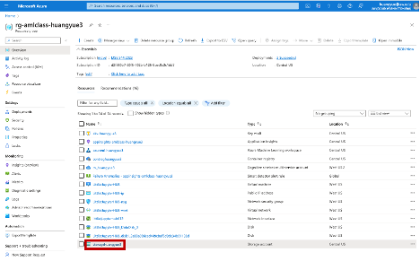

#Troubleshootng: If your datastore can't work, you can create one by yourself by the following steps:

## STEP 1 Copy your account key for the storage under your resource group

Navigate to your resource group via azure portal, choose the storage account under your own resources group, it will be called storage [UWNETID](rg-amlclass-UWNETID) 

Go to "Access keys" via sidebar.

Click show to show and copy key1.

## STEP 2 Create dataasset associate to a new datastore
Go to ML studio from your azure portal, data, under tab data asset, click create. Fill in information in the first two pages as yolov5 tutorial.

When filling the Storage type, hit "Create new datastore".

Pay attention here, you need to choose the storage account you chose in Step 1, choose blob container "azureml". Then choose "use account key" in the authentication type, and paste the account key you got from Step 1.

After the datastore is created, it will go back to the page of select a datastore, remember to select the one you just created. 

Then choose the file and upload.
